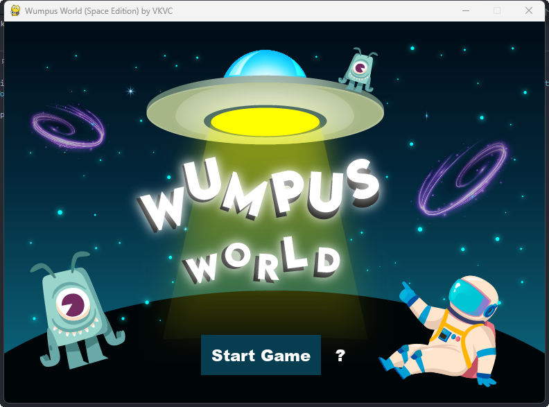
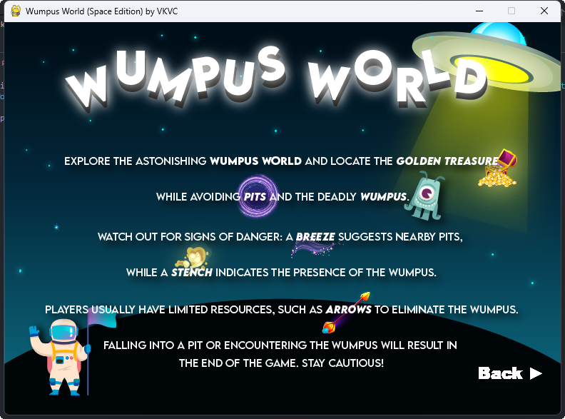
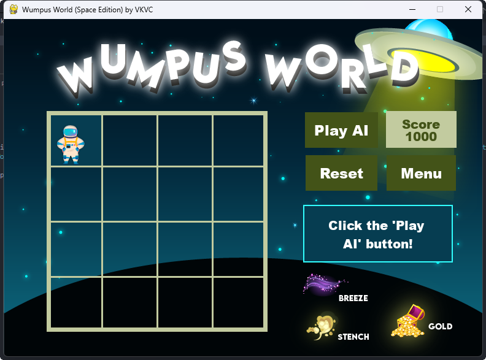
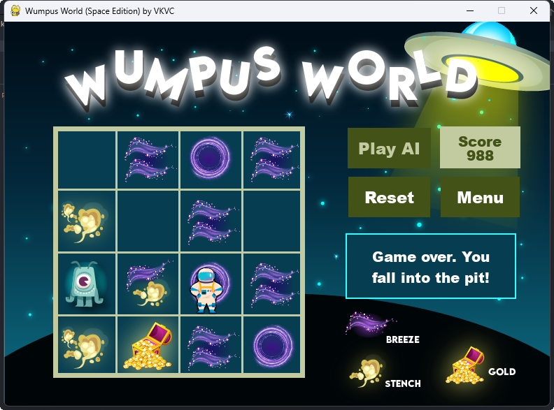
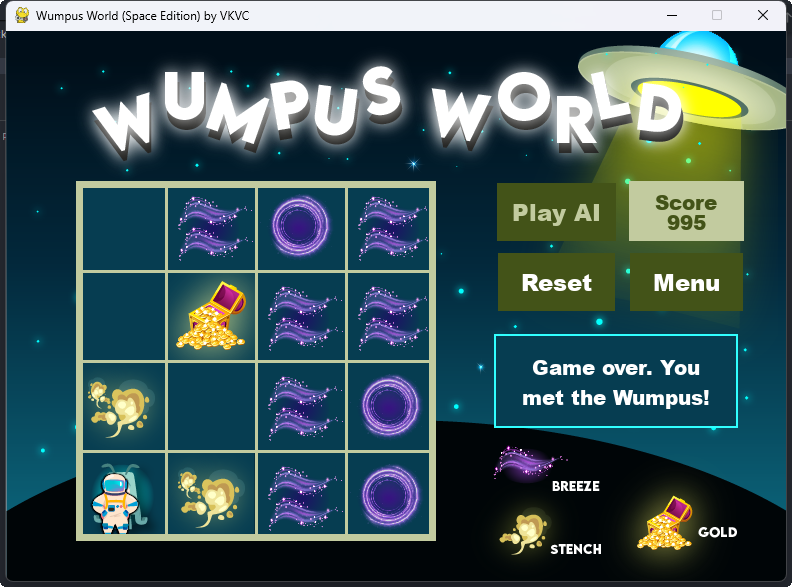
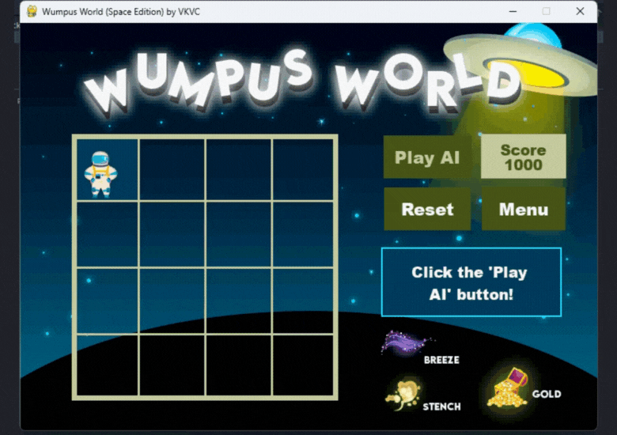

# ✨Wumpus World Game (Space Edition)

Welcome to the Wumpus Game Space Edition! Explore the depths of space in this adaptation of the classic Wumpus World game.


## How to Play

1. **Objective**: The mission is to navigate the treacherous space caverns, locate the golden treasure, and avoid dangerous hazards lurking in the darkness of space. 
   
2. **Symbols**:
   
| Gold | Wumpus | Pit | Stench | Breeze |
| :---: | :---: | :---: | :---: | :---: |
|  |  |  |  |  |


3. **Game Phases**:
   - **Setup**: The game randomly generates the cave layout, placing the wumpus, pits, and gold.
   - **AI Agent Move**: The AI agent makes a move based on its perception of the environment and the knowledge base it maintains.
   - **Game Over**: The game ends if you are eaten by the wumpus, fall into a pit, or successfully retrieve the gold.


4. **Scoring System**:
    - **`Moving`**: -1 point per move
    - **`Use of arrows`**: -10 points
    - **`Retrieving gold`**: +1000 points
    - **`Killing a Wumpus`**: +2000 points
  
   
5. **Winning Condition**:
   - Retrieve the gold and make it back to the starting position.
     

## How to Run

1. Clone this repository.  ` https://github.com/Vcarmelli/wumpus-world.git  `
2. Navigate to the directory containing the game files.
3. Run the following command:

```bash
python main.py
```


## Dependencies
- Python 3.11
- Pygame 2.5.2


## Screenshots

Here are some screenshots of the game:

### Title Screen


### Game Description


### Main Game
#### Starting Phase


#### Ending Phases
**Fall into Pit**



**Eaten by Wumpus**



**Retreiving Gold**




_Enjoy the adventure in the Wumpus World!_


---


<div align="center">
  <h6>Machine Problem 5 by Vashti Karmelli V. Camu</h6>
</div> 
